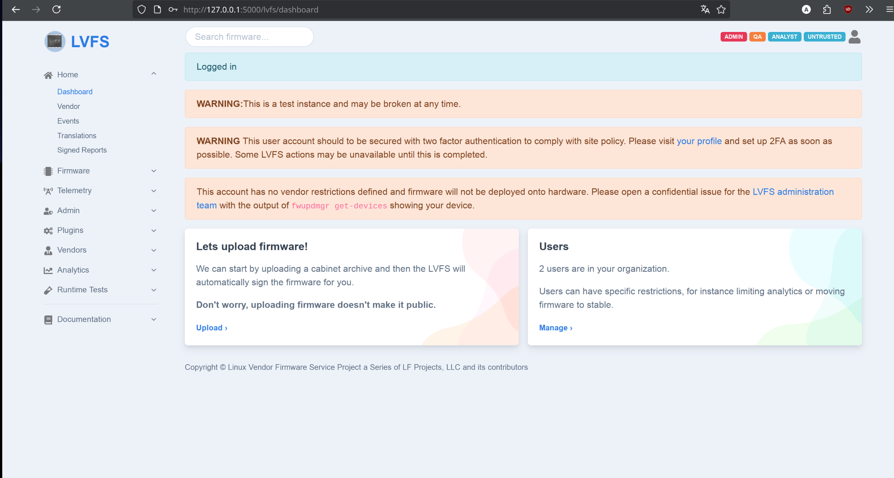
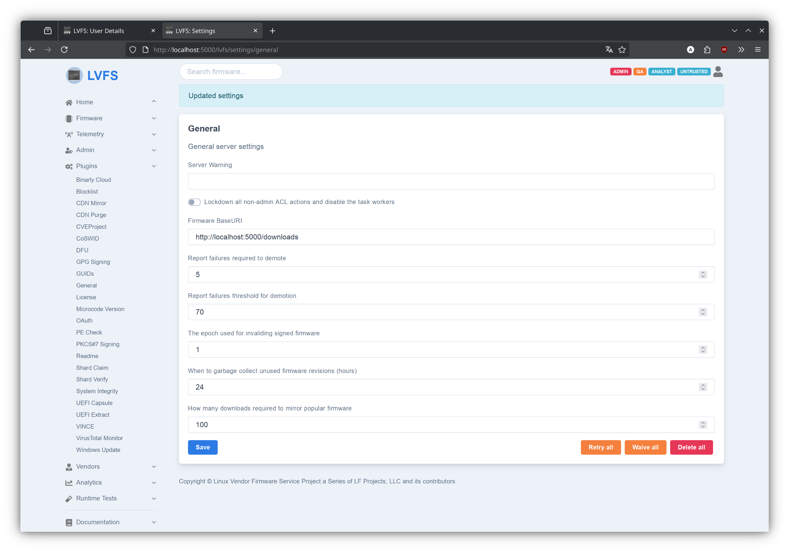
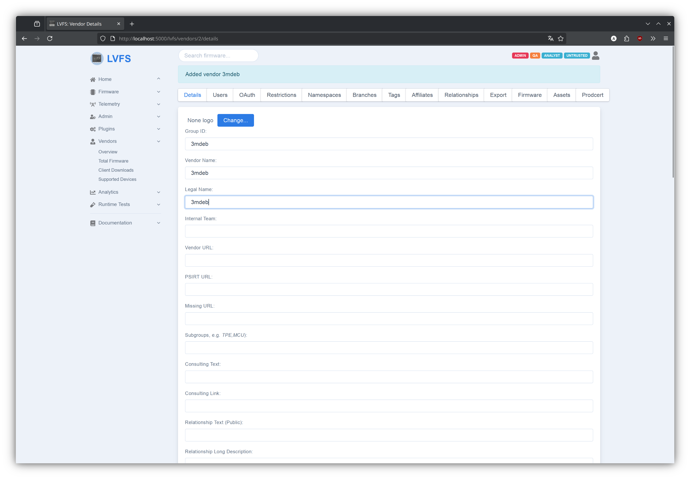
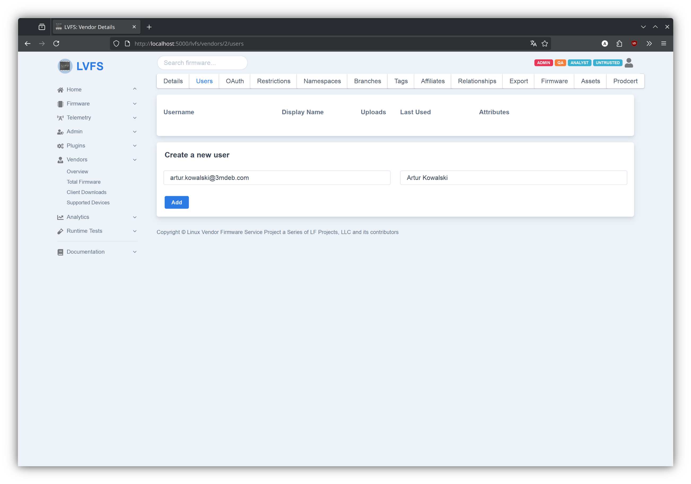
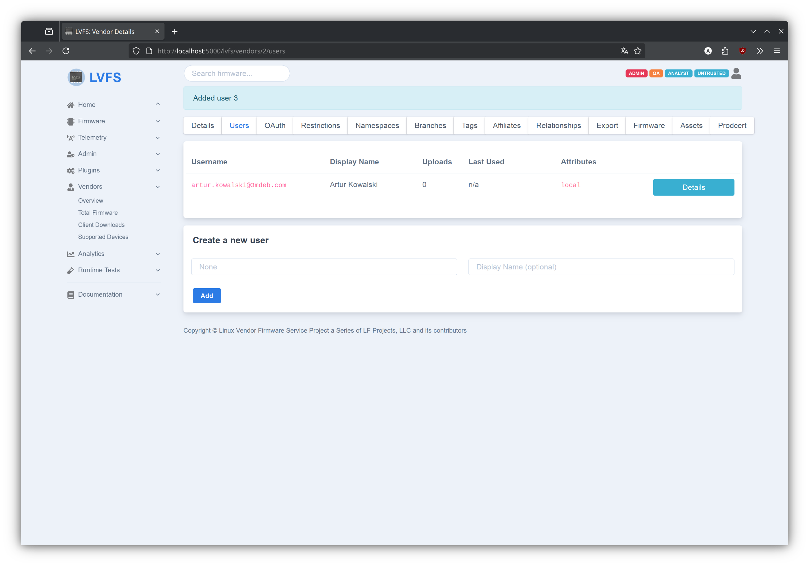
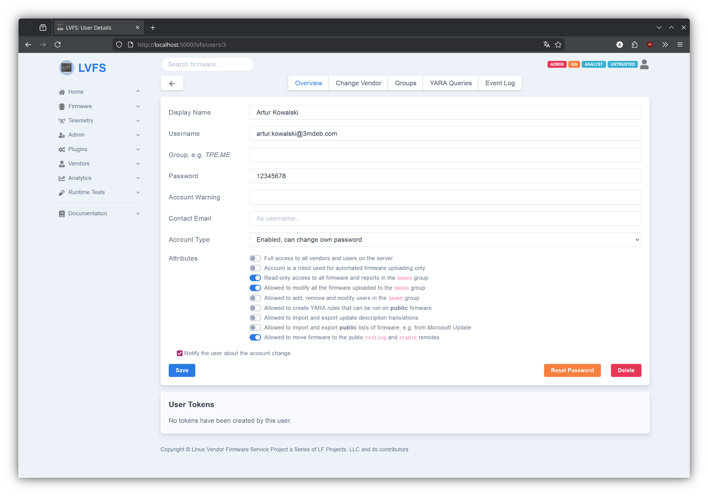
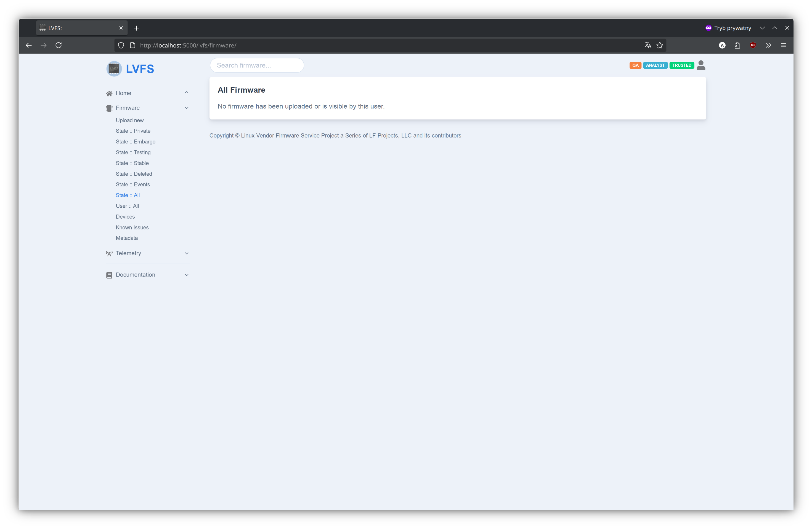
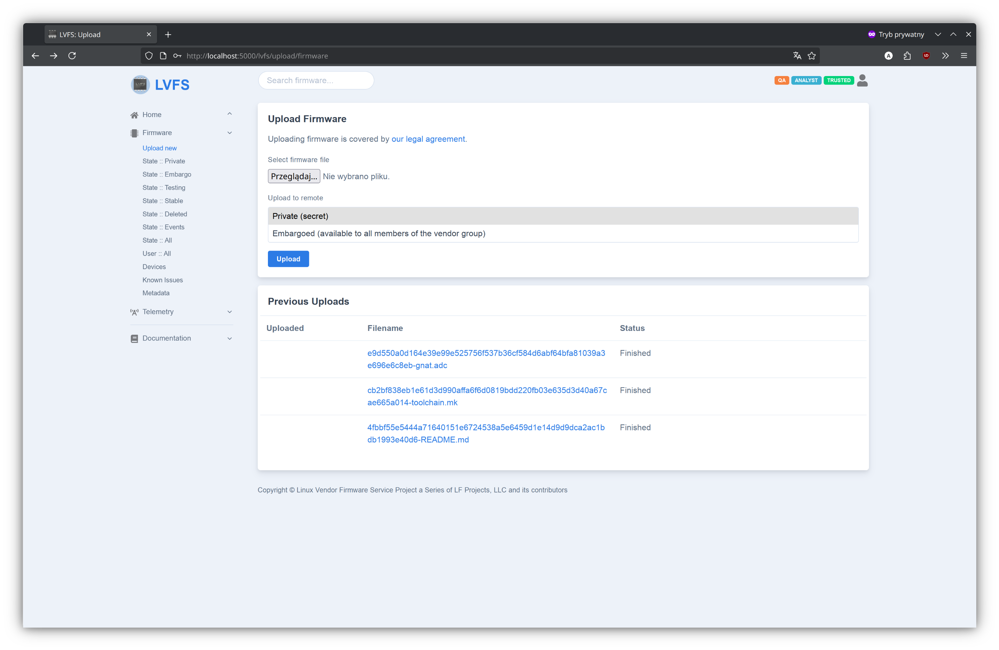

# Creating custom LVFS instance

> Note: instructions below are for reference only. They don't create a broken
> LVFS instance (see below for details).

Before proceding make sure you have [Nix](https://nixos.org/download/) installed.
As a next step generate secrets required by LVFS server:

```shell
nix run .#gen-secrets
```

Then, build the container and copy it to Docker

```shell
nix run .#container-lvfs.copyToDockerDaemon
```

Run it

```shell
docker compose up
```

To login into LVFS instance go to [http://localhost:5000](http://localhost:5000),
then use user `sign-test@fwupd.org` and password `Pa$$w0rd`.

> Note: default user and password is initialized from `lvfs/dbutils.py:init_db`
> and is always as above.



## Basic configuration

Go to `Plugins -> General` and change `Firmware BaseURI` to point to correct URL.
If running on localhost, this should be `http://localhost:5000/downloads`. You
may also want to clear `Server Warning`.



## Adding vendors and users

- start by going to `Vendors -> Overview` (left-side panel).
- put Vendor ID into `Group ID` field, this can be any string, e.g. `3mdeb` and
  click `Add` button
- fill `Vendor Name` and `Legal Name` fields, scroll down and click `Save`



- go to the `Users` tab, fill `Username` (should be email) and `Display Name`
  fields, click `Add` button


- click `Details` button of newly created user



- fill the `Password` field
- select `Allowed to move firmware to the public testing and stable remotes`
- select `Read-only access to all firmware and reports in the 3mdeb group`
- select `Allowed to modify all the firmware uploaded to the 3mdeb group`
- save the changes



## Uploading firmware

> Note: firmware upload seems to be broken (see below)

Log in as newly created and head to `Firmware -> Upload new`. You can select any
file for upload, doesn't have to be an actual firmware image, use `Embargoed` as
remote.

Unfortunately, firmware upload is not working properly, or rather accessing of
uploaded firmware is not working, as actual firmware files are put into Docker's
volume:

```shell
tree /var/lib/docker/volumes/lvfs-3mdeb_lvfs_data/_data
/var/lib/docker/volumes/lvfs-3mdeb_lvfs_data/_data
├── cache
│   ├── 2029240f6d1128be89ddc32729463129
│   ├── f5e9ac0799b013eb74c04ead2ef26f1e
│   ├── fcb15dfd79d3ec632ae679b9779668e8
│   └── ff8338158e5ff8843a2cb2d748fd89ec
├── certs
├── downloads
│   ├── 0761a569e798f9fbcf06635ead0b505e8cc66ff144f1a71a6515777c44c018d0-msi-ms7e06-v0.9.2.cap
│   ├── 0aeb4fe15095550a291c9982683bab62ee4ca7d6e4458b8fa215c5e1c59fafe6-Makefile
│   ├── 4fbbf55e5444a71640151e6724538a5e6459d1e14d9d9dca2ac1bdb1993e40d6-README.md
│   ├── ab15fd526bd8dd18a9e77ebc139656bf4d33e97fc7238cd11bf60e2b9b8666c6-COPYING
│   ├── cb2bf838eb1e61d3d990affa6f6d0819bdd220fb03e635d3d40a67cae665a014-toolchain.mk
│   └── e9d550a0d164e39e99e525756f537b36cf584d6abf64bfa81039a3e696e6c8eb-gnat.adc
├── lvfs.db
├── mirror
├── shards
└── uploads
```

But the firmware is not visible (in none of categories):



Previous uploads can be seen:



But clicking any of those links results in 404.

## Updating LVFS release

First, you need to manually edit `nix/lvfs.nix`. In the section:

```nix
src = deps.fetchFromGitLab {
  owner = "fwupd";
  repo = "lvfs-website";
  rev = "ed377f14b8e51d8bbe6edd57d2aa2201622bf732";
  hash = "sha256-jrSQwxZcyBxy+wZ8spRUL+MPr1JXozOdBzVGjOt7GNg=";
};
```

set `rev` to latest commit and `hash` to `sha256-AAAAAAAAAAAAAAAAAAAAAAAAAAAAAAAAAAAAAAAAAAA=`:

```nix
src = deps.fetchFromGitLab {
  owner = "fwupd";
  repo = "lvfs-website";
  rev = "ed377f14b8e51d8bbe6edd57d2aa2201622bf732";
  hash = "sha256-AAAAAAAAAAAAAAAAAAAAAAAAAAAAAAAAAAAAAAAAAAA=";
};
```

Run

```shell
nix run .#default.lock
```

And look valid hash in build output

```
error: hash mismatch in fixed-output derivation '/nix/store/fiajb23j5ancvz7gaibhq6ba8jidywg4-source.drv':
         specified: sha256-AAAAAAAAAAAAAAAAAAAAAAAAAAAAAAAAAAAAAAAAAAA=
            got:    sha256-jrSQwxZcyBxy+wZ8spRUL+MPr1JXozOdBzVGjOt7GNg=
```

Update `nix/lvfs.nix` with the correct hash and once again run

```shell
nix run .#default.lock
```

The command should succeed now. Before committing changes make sure the
container does build:

```shell
nix build -L --no-link
```

## Caveats

The configuration used in this repo is based on upstream
`docker/files/application/flaskapp.cfg` which is intended for production,
however there are some unsolved issues:

- everything marked as `TODO`, `FIXME` or `HACK`
- OAuth2 plugin should be either configured (if needed) or disabled, currently
  it is left in broken state failing with `No oauth client` when attempting
  login, yet it may still be a security risk.
- should run unittests/integration tests during build of Nix package
- database migration/upgrade is untested, probably requires setting `GIT_HASH`
  to work properly (see `docker/files/lvfs-entrypoint.sh` from upstream).
- SMTP is left unconfigured
- we use SQLite database instead of PostgreSQL because it's easier to setup.
  This is possible because SQLAlchemy (the frontend used by `lvfs-website`)
  supports multiple databases, however I don't know to what extent SQLAlchemy
  abstracts away differences between implementations so some issues are to be
  expected.
